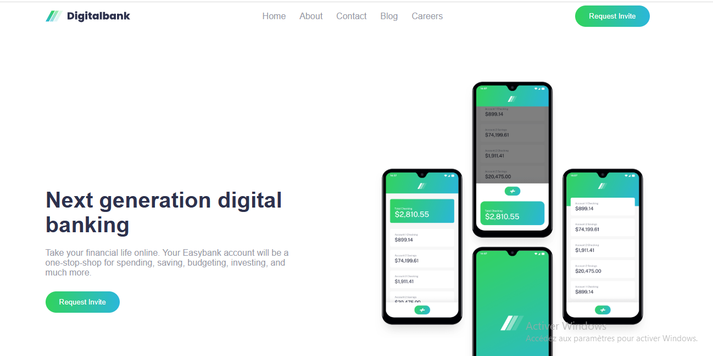
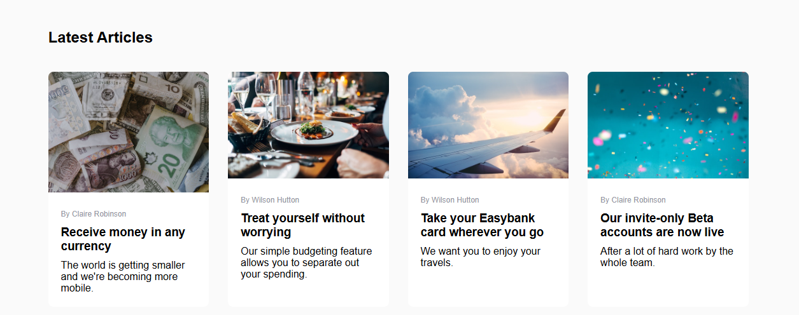

# Digital Bank Landing Page

A fully responsive **digital bank landing page** built with **HTML, CSS, and JavaScript**, created as a Frontend Mentor challenge. This project demonstrates modern layout techniques, mobile navigation, interactive hover/focus states, and a pixel-perfect responsive design.

## Live Demo

Check out the live site here: [Digital Bank Landing Page](https://freedev-group.github.io/Digital-bank-landing-page-By-Edouard/)

## Table of Contents

- [Overview](#overview)
- [Features](#features)
- [Technologies](#technologies)
- [Project Structure](#project-structure)
- [Screenshots](#screenshots)
- [How to Run Locally](#how-to-run-locally)
- [Author](#author)

---

## Overview

This landing page is a modern digital banking website interface. It includes:

- Hero section with a headline, description, CTA button, and mobile app mockup
- Features section highlighting the key services of Easybank
- Latest articles/blog section
- Fully functional footer with logo, links, and social icons
- Responsive navigation with mobile hamburger menu

The goal was to replicate the **Frontend Mentor design** closely while following clean coding and semantic HTML practices.

---

## Features

- Fully **responsive design** for desktop, tablet, and mobile
- Mobile navigation toggle (hamburger menu)
- Hover and focus states for all interactive elements
- Semantic HTML5 structure for accessibility
- Modern layout using **Flexbox** and **Grid**
- Gradient buttons, custom typography, and consistent spacing

---

## Technologies

- **HTML5** – Semantic markup
- **CSS3** – Flexbox, Grid, responsive styling
- **JavaScript** – Mobile menu toggle

---

## Project Structure
Digitalbank-landing-page : 

- index.html # Main HTML page
- style.css # Stylesheet
- script.js # JavaScript for mobile menu toggle
- images/ # All project images and icons

---

## Screenshots

**Desktop View:**  
  

**Mobile View:**  
  

**Optional Additional Screenshots:**  
 
 



---

## How to Run Locally

1. Clone the repository:

```bash```
git clone https://github.com/FreeDev-Group/Digital-bank-landing-page-By-Edouard

2. Navigate into the project folder:
        cd Digital-bank-landing-page-By-Edouard

3. Open index.html in your browser or use a local server to preview:
        open index.html

---

## Author
- Edouard KIZA NDENGO  
- GitHub: [edouardkne](https://github.com/edouardkne)  
- Inspired by the NFT Preview Card challenge on Frontend Mentor: [Challenge Link](https://www.frontendmentor.io/challenges/digital-bank-landing-page-WaUhkoDN)
